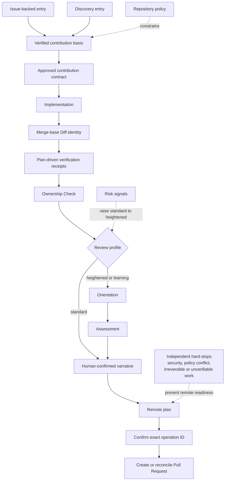

# Reviewworthy

Reviewworthy is a contributor-side workflow for proving that an AI-assisted contribution is needed, bounded, understood, and ready for maintainer review.

It does not optimize for the number of generated pull requests. It records why a contribution is wanted, checks repository policy, keeps a bounded contribution contract, preserves verification evidence, tests contributor understanding, and makes remote writes explicit and idempotent.

Reviewworthy's mandatory gates target External Contributions. Maintainer-authorized changes remain governed by the repository and may use direct push without a forced Reviewworthy PR; ordinary tests, CI, release evidence, and security handling still apply. Repository workflows decide when to invoke enforcement, and the core Action does not infer maintainer status.

The project brand is **Reviewworthy**. The portable Agent Skill is **`maintainer-first-contribution`**. Maintainer-friendly output is a projection of contributor evidence, not a separate maintainer-side workflow.

## Start with the Skill

The normal entry is an existing repository Issue. Ask an Agent with the installed `maintainer-first-contribution` Skill to prepare the contribution from that Issue. The Skill owns the conversation; the CLI preserves deterministic evidence and tells the Skill what is unresolved.

```bash
reviewworthy packet init --root . --contribution-id contribution-001
PACKET=.git/reviewworthy/v0.3/contributions/contribution-001/packet.json
reviewworthy status --packet "$PACKET" --json
reviewworthy next --packet "$PACKET" --json
```

From there, follow `next`: inspect repository policy, record and verify the Issue-backed contribution basis, agree the bounded Contract, implement only after approval, bind the finished Diff, run the Packet's verification plan, demonstrate ownership, and review the exact PR narrative before any confirmed remote write. Re-run `status` or `next` after each transition instead of reconstructing progress from prose.

After implementation, bind the exact clean current HEAD and merge-base Diff before verification:

```bash
reviewworthy diff bind --root . --packet "$PACKET" --base main --head HEAD --json
reviewworthy next --packet "$PACKET" --json
```

`diff bind` is intentionally separate from generic `diff capture`: it checks the Packet's approved scope and Diff budget, records the implementation result, updates the semantic snapshot, and deterministically routes the workflow into verification. It does not create another persisted readiness field.

Discovery is an advanced entry when no suitable Issue exists and repository policy permits it. Use the candidate and Contribution Signal commands to establish a defensible basis before the same Contract, implementation, Diff-binding, and verification path. Discovery recommendations are evidence, never authorization.

The CLI and Skill form one contributor-side product. The full Contribution Packet stays in Git-private local state. A PR Body receives a human-readable contribution-evidence overview plus the existing machine-readable Evidence Summary for the optional read-only repository Action. `status` derives the current stage and blockers; `next` returns one deterministic next action. Packets bind evidence to a GitHub repository identity. The remote adapter uses the user's authenticated `gh` CLI and refuses to write unless the current rendered operation ID is explicitly confirmed.

## Workflow contract

The conceptual progression is shared by both entry paths. `status` reports the earliest unresolved stage from current Packet evidence; it is not a separately stored workflow state. The `implementation` stage is likewise derived from the Packet's existing implementation result and deterministic Diff binding. Independent hard-stops take priority over ordinary progress routing.



Discovery evidence may serve as the contribution basis when repository policy explicitly allows it. Signal `0.3` keeps record type, claim type, lifecycle, verification, and authority as independent axes. A selected Discovery or signal-backed contribution must record a valid Contribution Signal before implementation or remote readiness; it does not need maintainer confirmation. External Issue, Pull Request, and Discussion records must use a matching public GitHub reference and successful verification record; local reproducible evidence uses `local_evidence` plus `reproducible_evidence`. `signal verify` is read-only by default; `signal verify --record` persists the exact successful check for readiness. Discussion verification uses GitHub GraphQL. `signal publish` is an explicit, idempotent Issue write and never infers maintainer intent. A verified, pending Issue is sufficient for the Issue-backed path; normalized `not planned` blocks progression, while an exact normalized `duplicate` label is an independent blocker. `completed` and `reopened` do not block by themselves.

Candidate recommendations are evidence-backed guidance, not authorization. `do_not_contribute` is a hard stop. `issue_only` and `seek_maintainer_signal` may transition to `plan_directly` only through an explicit human-confirmed reason; that transition does not bypass the required Issue or public Signal verification gate.

Every node records a result. Review profile is `standard`, `heightened`, or `learning`; risk signals raise Standard to Heightened. Standard requires a light Ownership Check covering the problem, scope, verification, and risks. Heightened and Learning additionally require Orientation and Assessment with the full behavior, invariant, test, flow, tradeoff, failure, and regression rubric. Security issues, policy conflicts, irreversible changes, and unverifiable results remain independent hard-stops.

The contract must be explicitly approved before implementation. Once the implementation is coherent, `diff bind` requires the selected head to be the current clean HEAD, recomputes the merge-base Diff, enforces the approved scope and Diff budget, and updates the existing implementation result. Verification is defined by a versioned Packet plan whose checks have stable IDs, argv, repository-relative cwd, and a required flag. `verify run` executes a named check with bounded time and captured output, then records a receipt `0.3` bound to the exact plan digest, canonical `subject_digest`, stable HEAD, and clean worktree. A required check is ready only with `command_outcome=passed`, `integrity_status=stable`, and `provenance=contributor_local`. Timestamps and output hashes are audit-only. For Heightened and Learning, Orientation must pass before Assessment and both bind to the semantic snapshot; changing contribution decisions, the subject, plan, or semantic outcome invalidates them.

## Local development

The runtime requires Python 3.11 or newer and has no third-party runtime dependencies.

```bash
python -m pip install --requirement requirements-dev.txt  # test/CI-only dependency
PYTHONPATH=src python -m unittest discover -s tests -v
PYTHONPATH=src python -m reviewworthy --version
```

To install the console script locally:

```bash
python -m pip install -e .
reviewworthy policy inspect .
```

## Policy discovery

Reviewworthy reads repository-authored policy documents first, including `README`, `CONTRIBUTING`, `SECURITY`, `AGENTS`, `.github` templates, and Markdown under `docs/`. An optional `.reviewworthy/policy.toml` supplies structured claims where documents are silent. Explicit negative statements become `false`; contradictions across sources produce `policy_conflict`, while opposed claims inside one source produce `policy_ambiguity`. Both are hard stops and are never silently overridden.

Unknown policy, including an explicit `allowed = "unknown"` claim, enters Conservative mode. The CLI preserves human approval and disclosure requirements. The Action reads policy only from the runner-owned base commit: positive natural-language claims are advisory, positive machine authority comes only from base-tree `.reviewworthy/policy.toml`, and explicit prohibitions, conflicts, or ambiguities can block `evidence-enforce`.

Policy inspection also emits claim records with `true`/`false`/`unknown` state and source line/excerpt hashes. Document provenance is tied to the exact matched claim; structured provenance is tied to the parsed TOML table/key rather than an unrelated same-named key. Structured policy fills silence and remains provenance-bearing; conflicting sources produce an unknown claim plus a hard-stop rather than an opaque automatic decision.

## Remote writes

Remote writes are opt-in and use a two-step local protocol:

1. Render the exact target, title, Body, permissions, and stable operation ID with `remote plan`.
2. Run `remote create` with that exact operation ID.

The operation ID is embedded in a hidden Body marker. Before creating an Issue or Pull Request, Reviewworthy searches for the marker. An uncertain network result must be reconciled before retrying; the tool never blindly creates a duplicate.

For Pull Requests, `remote plan/create` recomputes the contribution Diff from the selected base/head merge base. Packet `0.3` binds `comparison=merge_base`, `base_tip_sha`, `merge_base_sha`, `head_sha`, `subject_digest`, `fingerprint_algorithm`, changed files, additions, and deletions; every field must match before the operation is rendered or written. Version `0.3` does not read, recognize, migrate, or reconcile older Packet, Signal, receipt, pending-state, or marker formats.

For a policy-required Draft PR, the draft state is included in the operation ID and passed to `gh pr create --draft`. A pending local operation record is persisted immediately before a create; if the create or receipt persistence is uncertain, later retries stop for reconciliation instead of issuing another create. Current receipts live only under ignored `local/v0.3/operations/` state and carry `state_version=0.3`; older pending or receipt paths are not inspected. Reviewworthy reads the actual remote PR head after create or remote reconciliation and again immediately before an Issue-note write; an unavailable or mismatched head becomes `remote_pr_head_unavailable` or `remote_pr_head_mismatch` and requires reconciliation. Multiple current marker matches stop for reconciliation. Issue-backed PRs contain the canonical Issue URL in the Body and add one exact PR URL note to that Issue; head uncertainty and note failures become `needs_reconciliation` without a second confirmation or another PR. Because GitHub exposes head reads and Issue comments as separate APIs, a head update concurrent with the comment POST remains a narrow provider race that receipts cannot make atomic.

The first release does not create review comments or Discussions, close PRs, merge changes, or use an LLM as an Action gatekeeper. It can verify a referenced Discussion read-only through GraphQL; it does not publish Discussions or interpret maintainer responses.

The repository also ships a read-only composite Action in [`action.yml`](./action.yml). The pull-request Body shows maintainers a human-readable overview, followed by the current versioned machine-readable Evidence Summary. The overview labels contributor-local verification, ownership, and AI disclosure as claims; “ready for maintainer review” describes completion of the contributor workflow, not maintainer approval or a quality score. The Action parses the machine block and recomputes repository- and diff-owned facts. Default `report` mode is non-blocking; `evidence-enforce` requires a valid current Summary and exact recomputed diff identity. The Action never reads a Packet from the checkout, fetches missing objects, publishes, comments, or infers maintainer approval. Consumers that enable `evidence-enforce` should check out with `fetch-depth: 0`.

The runtime has no third-party dependencies. Schema validation is a test/CI-only concern: `requirements-dev.txt` installs `jsonschema`, and CI validates the portable schemas and generated test artifacts without adding it to the package runtime dependencies. Fixture evals assert exact blocker/violation sets and conclusion/result outcomes rather than whole response snapshots.

## Documents

- [Domain language](./CONTEXT.md)
- [Agent Skill](./SKILL.md)
- [Project brief and orientation](./references/onboarding-contract.md)
- [Candidate evidence matrix](./references/candidate-scoring.md)
- [Contribution Signal](./references/contribution-signal.md)
- [Contribution Contract](./references/contribution-contract.md)
- [AI disclosure](./references/ai-disclosure.md)
- [Fixture evaluations](./references/evaluation.md)
- [Action, eval, and Schema CI](./references/action-and-ci.md)
- [Policy discovery reference](./references/policy-discovery.md)
- [Understanding gate reference](./references/understanding-gate.md)
- [Remote write reference](./references/remote-writes.md)
- [Architecture decisions](./docs/adr/)
- [Threat model](./THREAT_MODEL.md)

## Status

This is an early open-source foundation released under the [MIT License](./LICENSE). The current slice adds deterministic project facts, evidence-first candidate menus, orthogonal Contribution Signals, read-only GitHub Issue/PR/Discussion verification, explicit Issue publication, candidate-to-packet binding and transition gates, structured understanding records, a read-only Action wrapper, standalone Contribution Contracts, policy-aware disclosure records, and provider-free fixture evaluations. Maintainer-response inference, Discussion publication, richer provider adapters, and deeper project-specific onboarding remain later slices.
