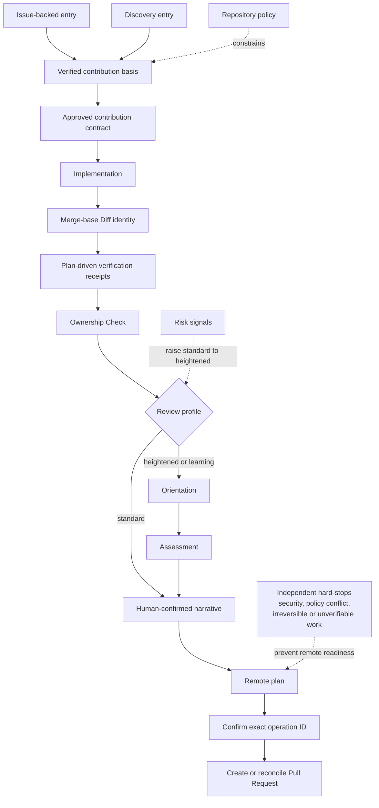

# Reviewworthy

Reviewworthy is a contributor-side workflow for proving that an AI-assisted contribution is needed, bounded, understood, and ready for maintainer review.

It does not optimize for the number of generated pull requests. It records why a contribution is wanted, checks repository policy, keeps a bounded contribution contract, preserves verification evidence, tests contributor understanding, and makes remote writes explicit and idempotent.

Reviewworthy's mandatory gates target External Contributions. Maintainer-authorized changes remain governed by the repository and may use direct push without a forced Reviewworthy PR; ordinary tests, CI, release evidence, and security handling still apply. Repository workflows decide when to invoke enforcement, and the core Action does not infer maintainer status.

The project brand is **Reviewworthy**. The portable Agent Skill is **`maintainer-first-contribution`**. Maintainer-friendly output is a projection of contributor evidence, not a separate maintainer-side workflow.

## Start with the Skill

The normal entry is an existing repository Issue. Ask an Agent with the installed `maintainer-first-contribution` Skill to prepare the contribution from that Issue. The Skill owns the conversation; the CLI preserves deterministic evidence and tells the Skill what is unresolved.

```bash
reviewworthy start --root . --contribution-id contribution-001 \
  --issue https://github.com/OWNER/REPO/issues/123 --focus src/relevant-file.py --json
# Use the returned Packet path (Git worktrees may use a different metadata path):
PACKET=$(git rev-parse --git-path reviewworthy/v0.3/contributions/contribution-001/packet.json)
reviewworthy status --packet "$PACKET" --json
reviewworthy next --packet "$PACKET" --json
```

`start` creates or reuses Git-private Packet and Project Brief artifacts, binds
current repository policy and the explicit Issue on initialization, and verifies
the Issue through read-only `gh` calls. Repeat `--focus` for additional selected
files. It returns artifact paths and the next action; provider failures preserve
those artifacts for retry. Repeating start retains existing bound decisions and
contributor content, reports Brief freshness, and labels reused verification.
The Brief remains a source manifest; the Skill and contributor own understanding.

For advanced initialization, use `packet init`. To deliberately refresh policy or
change the basis, use typed operations without editing the Packet or inventing a
Candidate Menu:

```bash
reviewworthy packet policy bind --root . --packet "$PACKET" --json
reviewworthy packet basis record --packet "$PACKET" --issue https://github.com/OWNER/REPO/issues/123 --json
reviewworthy issue verify --packet "$PACKET" --record --json
```

For an existing Signal artifact, use `packet basis record --packet "$PACKET" --signal FILE`.
Local Signals may supply `--repository OWNER/REPO` when the Packet has no identity;
external references infer it and reject a conflicting established identity.
Verified external Signals also populate an absent immutable repository ID from
their validated provider evidence.
External Signals still need the existing read-only `signal verify FILE --record`
operation before binding for readiness. Recording a basis preserves candidate
recommendation and duplicate-work gates already present in the Packet. Material
basis or policy changes reset Contract approval and affected downstream evidence;
identical inputs and provider timestamp refreshes preserve current evidence.

From there, follow `next`: inspect repository policy, record and verify the Issue-backed contribution basis, agree the bounded Contract, implement only after approval, bind the finished Diff, run the Packet's verification plan, demonstrate ownership, and review the exact PR narrative before any confirmed remote write. Re-run `status` or `next` after each transition instead of reconstructing progress from prose.

Prepare a bounded Contract and a plan with exact check commands; the Skill helps
write those inputs and obtains the contributor's decisions. The CLI leaves absent
human choices visible in `next`, including actual PR target refs at the ready
boundary. If a matching current remote operation is unresolved, `next` suggests
saved-operation reconciliation while retaining the Packet's evidence-derived stage.

Keep working Contract, review, plan, Ownership, AI and Body input files beside the
returned Packet (or in another Git-ignored location). Diff binding and receipt
execution require a clean worktree; evidence drafts must not accidentally become
contribution changes.

Before implementation, use the existing Contract, review and plan shapes:

```bash
reviewworthy packet contract bind --packet "$PACKET" --contract contract.json --json
# Only after the human has approved the current embedded Contract:
reviewworthy packet contract approve --packet "$PACKET" --human-confirmed --json
reviewworthy packet review record --packet "$PACKET" --input review.json --json
reviewworthy packet verification plan --packet "$PACKET" --input verification-plan.json --json
reviewworthy next --packet "$PACKET" --json
```

`review.json` is the existing Packet review section or a `risk assess --json`
result. `verification-plan.json` contains the existing `plan_version` and `checks`
fields. Each check keeps its exact `id`, `argv`, repository-relative `cwd`, and
boolean `required`. The CLI owns approval hashes, plan digests, snapshots and
results. These operations never consume a generic Packet patch.

After implementation, bind the exact clean current HEAD and merge-base Diff before verification:

```bash
reviewworthy diff bind --root . --packet "$PACKET" --base main --head HEAD --json
reviewworthy next --packet "$PACKET" --json
```

Complete the post-implementation evidence through typed operations:

```bash
reviewworthy verify run --root . --packet "$PACKET" --check-id unit --json
reviewworthy packet ownership record --packet "$PACKET" --input ownership.json --json
reviewworthy packet ai record --packet "$PACKET" --input ai-assistance.json --json
reviewworthy packet narrative record --packet "$PACKET" --title "Fix the bounded failure" --body-file body.md --json
reviewworthy packet narrative preview --packet "$PACKET" --output .git/reviewworthy/body.md --json
# Only after the human approves the displayed prose and current disclosure:
reviewworthy packet narrative confirm --packet "$PACKET" --human-confirmed --json
reviewworthy next --packet "$PACKET" --json
```

Ownership and AI inputs are the existing Packet sections, with explicit check
outcomes and boolean human claims. Policy-required human expression can be supplied
with `--human-expression-file FILE` on narrative recording. Heightened/Learning
still require current Orientation followed by Assessment before final confirmation.
The preview exports the exact current Body for subsequent remote commands and shows
the public evidence projection; `remote plan` additionally renders the operation
marker and recomputes Git identity. Remote title/Body inputs must match the Packet
exactly, including whitespace. Material edits require appropriate human reapproval;
audit-only receipt timestamps and output hashes preserve evidence.
Before a check executes, its previous receipt is withdrawn. If execution times out,
cannot start, or is interrupted, rerun that check and renew the affected human
evidence; an identical successful rerun preserves existing confirmations. Other
checks' receipts are retained.

When returned provider evidence fails validation, `issue verify --record`
withdraws the Packet's prior Issue verification and invalidates affected downstream
evidence. `signal verify --record` likewise withdraws prior standalone Signal
verification. Queries without `--record` leave stored evidence unchanged;
neither command infers Signal lifecycle or authority.

`diff bind` is intentionally separate from generic `diff capture`: it checks the Packet's approved scope and Diff budget, records the implementation result, updates the semantic snapshot, and deterministically routes the workflow into verification. It does not create another persisted readiness field.

Discovery is an advanced entry when no suitable Issue exists and repository policy permits it. Use the candidate and Contribution Signal commands to establish a defensible basis before the same Contract, implementation, Diff-binding, and verification path. Discovery recommendations are evidence, never authorization.

The CLI and Skill form one contributor-side product. The full Contribution Packet stays in Git-private local state. A PR Body receives a human-readable contribution-evidence overview plus the existing machine-readable Evidence Summary for the optional read-only repository Action. `status` derives the current stage and blockers; `next` returns one deterministic next action. Packets bind evidence to a GitHub repository identity. The remote adapter uses the user's authenticated `gh` CLI and refuses to write unless the current rendered operation ID is explicitly confirmed.

## Workflow contract

The conceptual progression is shared by both entry paths. `status` reports the earliest unresolved stage from current Packet evidence; it is not a separately stored workflow state. The `implementation` stage is likewise derived from the Packet's existing implementation result and deterministic Diff binding. Independent hard-stops take priority over ordinary progress routing.


```mermaid
flowchart TB
    ISSUE["Issue-backed entry"] --> BASIS["Verified contribution basis"]
    DISCOVERY["Discovery entry"] --> BASIS
    POLICY["Repository policy"] -. "constrains" .-> BASIS

    BASIS --> CONTRACT["Approved contribution contract"]
    CONTRACT --> CHANGE["Implementation"]
    CHANGE --> DIFF["Merge-base Diff identity"]
    DIFF --> VERIFY["Plan-driven verification receipts"]
    VERIFY --> OWNERSHIP["Ownership Check"]
    OWNERSHIP --> PROFILE{"Review profile"}

    PROFILE -->|standard| NARRATIVE["Human-confirmed narrative"]
    PROFILE -->|heightened or learning| ORIENTATION["Orientation"]
    ORIENTATION --> ASSESSMENT["Assessment"]
    ASSESSMENT --> NARRATIVE

    NARRATIVE --> PLAN["Remote plan"]
    PLAN --> CONFIRM["Confirm exact operation ID"]
    CONFIRM --> PR["Create or reconcile Pull Request"]

    RISK["Risk signals"] -. "raise standard to heightened" .-> PROFILE
    HARD["Independent hard-stops<br/>security, policy conflict,<br/>irreversible or unverifiable work"] -. "prevent remote readiness" .-> PLAN
```

Discovery evidence may serve as the contribution basis when repository policy explicitly allows it. Signal `0.3` keeps record type, claim type, lifecycle, verification, and authority as independent axes. A selected Discovery or signal-backed contribution must record a valid Contribution Signal before implementation or remote readiness; it does not need maintainer confirmation. External Issue, Pull Request, and Discussion records must use a matching public GitHub reference and successful verification record; local reproducible evidence uses `local_evidence` plus `reproducible_evidence`. `signal verify` is read-only by default; `signal verify --record` persists the exact successful check for readiness. Discussion verification uses GitHub GraphQL. `signal publish` is an explicit, idempotent Issue write and never infers maintainer intent. A verified, pending Issue is sufficient for the Issue-backed path; normalized `not planned` blocks progression, while an exact normalized `duplicate` label is an independent blocker. `completed` and `reopened` do not block by themselves.

Candidate recommendations are evidence-backed guidance, not authorization. `do_not_contribute` is a hard stop. `issue_only` and `seek_maintainer_signal` may transition to `plan_directly` only through an explicit human-confirmed reason; that transition does not bypass the required Issue or public Signal verification gate.

Every node records a result. Review profile is `standard`, `heightened`, or `learning`; risk signals raise Standard to Heightened. Standard requires a light Ownership Check covering the problem, scope, verification, and risks. Heightened and Learning additionally require Orientation and Assessment with the full behavior, invariant, test, flow, tradeoff, failure, and regression rubric. Security issues, policy conflicts, irreversible changes, and unverifiable results remain independent hard-stops.

The contract must be explicitly approved before implementation. Once the implementation is coherent, `diff bind` requires the selected head to be the current clean HEAD, recomputes the merge-base Diff, enforces the approved scope and Diff budget, and updates the existing implementation result. Verification is defined by a versioned Packet plan whose checks have stable IDs, argv, repository-relative cwd, and a required flag. `verify run` executes a named check with bounded time and captured output, then records a receipt `0.3` bound to the exact plan digest, canonical `subject_digest`, stable HEAD, and clean worktree. A required check is ready only with `command_outcome=passed`, `integrity_status=stable`, and `provenance=contributor_local`. Timestamps and output hashes are audit-only. For Heightened and Learning, Orientation must pass before Assessment and both bind to the semantic snapshot; changing contribution decisions, the subject, plan, or semantic outcome invalidates them.

## Local development

The runtime requires Python 3.11 or newer and has no third-party runtime dependencies.

```bash
python -m pip install --requirement requirements-dev.txt  # test/CI-only dependency
PYTHONPATH=src python -m unittest discover -s tests -v
PYTHONPATH=src python -m reviewworthy --version
```

To install the console script locally:

```bash
python -m pip install -e .
reviewworthy policy inspect .
```

## Policy discovery

Reviewworthy reads repository-authored policy documents first, including root `README`, `CONTRIBUTING`, `SECURITY`, `AGENTS` documents and `.github` Issue/PR templates. Other `.github` files and `docs` are excluded by default; `[discovery] authoritative_documents` in `.reviewworthy/policy.toml` adds exact authoritative documents. Project orientation discovery remains separate. An optional `.reviewworthy/policy.toml` supplies structured claims where documents are silent. Explicit negative statements become `false`; contradictions across sources produce `policy_conflict`, while opposed claims inside one source produce `policy_ambiguity`. Both are hard stops and are never silently overridden.

Unknown policy, including an explicit `allowed = "unknown"` claim, enters Conservative mode. The CLI preserves human approval and disclosure requirements. The Action reads policy only from the runner-owned base commit: positive natural-language claims are advisory, positive machine authority comes only from base-tree `.reviewworthy/policy.toml`, and explicit prohibitions, conflicts, or ambiguities can block `evidence-enforce`.

Policy inspection also emits claim records with `true`/`false`/`unknown` state and source line/excerpt hashes. Document provenance is tied to the exact matched claim; structured provenance is tied to the parsed TOML table/key rather than an unrelated same-named key. Structured policy fills silence and remains provenance-bearing; conflicting sources produce an unknown claim plus a hard-stop rather than an opaque automatic decision.

## Remote writes

Remote writes are opt-in and use a two-step local protocol:

1. Render the exact target, title, Body, permissions, and stable operation ID with `remote plan`.
2. Run `remote create` with that exact operation ID.

The operation ID is embedded in a hidden Body marker. Before creating an Issue or Pull Request, Reviewworthy searches for the marker. An uncertain network result must be reconciled before retrying; the tool never blindly creates a duplicate.

Recover a saved current operation with `remote reconcile --state FILE --json`,
independently of today's Packet, input files or Git refs. It checks the live object
and repairs local state; an absent Issue note requires the original operation ID
via `--confirm-operation-id`. Signal publication uses
`signal publish reconcile SIGNAL_PATH --state FILE --json`. After manual inspection,
`--retry-uncertain` on the original confirmed create permits one attempt only for a
valid pending object creation and fresh zero-marker search, accepting residual
duplicate risk. Each create preserves its canonical result and performs one bounded
post-create inspection; incomplete visibility or visible duplicate URLs require
reconciliation. See the [recovery guidance](./references/remote-writes.md).

For Pull Requests, `remote plan/create` recomputes the contribution Diff from the selected base/head merge base. Packet `0.3` binds `comparison=merge_base`, `base_tip_sha`, `merge_base_sha`, `head_sha`, `subject_digest`, `fingerprint_algorithm`, changed files, additions, and deletions; every field must match before the operation is rendered or written. Version `0.3` does not read, recognize, migrate, or reconcile older Packet, Signal, receipt, pending-state, or marker formats.

For a policy-required Draft PR, the draft state is included in the operation ID and passed to `gh pr create --draft`. A pending local operation record is persisted immediately before a create; if the create or receipt persistence is uncertain, later retries stop for reconciliation instead of issuing another create. Current receipts live only under ignored `local/v0.3/operations/` state and carry `state_version=0.3`; older pending or receipt paths are not inspected. Reviewworthy reads the actual remote PR head after create or remote reconciliation and again immediately before an Issue-note write; an unavailable or mismatched head becomes `remote_pr_head_unavailable` or `remote_pr_head_mismatch` and requires reconciliation. Multiple current marker matches stop for reconciliation. Issue-backed PRs contain the canonical Issue URL in the Body and add one exact PR URL note to that Issue; head uncertainty and note failures become `needs_reconciliation` without a second confirmation or another PR. Because GitHub exposes head reads and Issue comments as separate APIs, a head update concurrent with the comment POST remains a narrow provider race that receipts cannot make atomic.

The first release does not create review comments or Discussions, close PRs, merge changes, or use an LLM as an Action gatekeeper. It can verify a referenced Discussion read-only through GraphQL; it does not publish Discussions or interpret maintainer responses.

Provider verification and remote writes currently support public repositories on
`github.com` through the authenticated `gh` CLI. Private repositories, GitHub
Enterprise hosts, and private advisory APIs are outside that adapter contract.
The [private security-reporting exception](./SECURITY.md) is a human-owned intake
and coordinated-fix process; the CLI does not ingest private reports or require
their details to be published to satisfy ordinary contribution gates.

The repository also ships a read-only composite Action in [`action.yml`](./action.yml). The pull-request Body shows maintainers a human-readable overview, followed by the current versioned machine-readable Evidence Summary. The overview labels contributor-local verification, ownership, and AI disclosure as claims; “ready for maintainer review” describes completion of the contributor workflow, not maintainer approval or a quality score. The Action parses the machine block and recomputes repository- and diff-owned facts. Default `report` mode is non-blocking; `evidence-enforce` requires a valid current Summary and exact recomputed diff identity. The Action never reads a Packet from the checkout, fetches missing objects, publishes, comments, or infers maintainer approval. Consumers that enable `evidence-enforce` should check out with `fetch-depth: 0`.

The runtime has no third-party dependencies. Schema validation is a test/CI-only concern: `requirements-dev.txt` installs `jsonschema`, and CI validates the portable schemas and generated test artifacts without adding it to the package runtime dependencies. Fixture evals assert exact blocker/violation sets and conclusion/result outcomes rather than whole response snapshots.

The composite wrapper checks runnable Python >=3.11 and Git before importing the
package; missing prerequisites fail in both modes even though report findings are
non-blocking. Consumer workflows should use `contents: read`, disable persisted
checkout credentials, and pin all Actions to verified published full commits.
Do not execute untrusted head code under privileged events. See the
[Action setup and trust boundaries](./references/action-and-ci.md) for complete
history, base-tree authority, and the Python 3.11–3.13 CI matrix.

## Documents

- [Domain language](./CONTEXT.md)
- [Agent Skill](./SKILL.md)
- [Project brief and orientation](./references/onboarding-contract.md)
- [Candidate evidence matrix](./references/candidate-scoring.md)
- [Contribution Signal](./references/contribution-signal.md)
- [Contribution Contract](./references/contribution-contract.md)
- [AI disclosure](./references/ai-disclosure.md)
- [Fixture evaluations](./references/evaluation.md)
- [Action, eval, and Schema CI](./references/action-and-ci.md)
- [Policy discovery reference](./references/policy-discovery.md)
- [Understanding gate reference](./references/understanding-gate.md)
- [Remote write reference](./references/remote-writes.md)
- [Architecture decisions](./docs/adr/)
- [Threat model](./THREAT_MODEL.md)
- [Implementation plan (2026-09-30)](./references/implementation-plan-2026-09-30.md)

## Status

This is an early open-source foundation released under the [MIT License](./LICENSE). The current slice adds deterministic project facts, evidence-first candidate menus, orthogonal Contribution Signals, read-only GitHub Issue/PR/Discussion verification, explicit Issue publication, candidate-to-packet binding and transition gates, structured understanding records, a read-only Action wrapper, standalone Contribution Contracts, policy-aware disclosure records, and provider-free fixture evaluations. Maintainer-response inference, Discussion publication, richer provider adapters, and deeper project-specific onboarding remain later slices.
