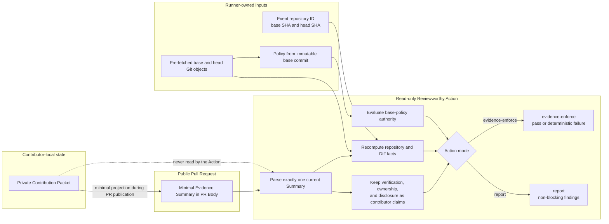

# Action, eval, and Schema CI

The composite Action is read-only and never reads a private Contribution Packet from the checkout. It parses exactly one current Evidence Summary from the pull-request Body and recomputes repository- and diff-owned facts from runner event identity plus the checked-out Git objects.

Default `report` mode keeps missing or uncertain evidence non-blocking. `evidence-enforce` requires:

- one valid current Evidence Summary;
- a real `pull_request` event with exact repository slug, numeric repository ID, base SHA, and head SHA;
- complete merge-base Diff agreement across base tip, merge base, head, canonical subject digest, fingerprint algorithm, changed files, additions, and deletions;
- policy evaluation from the immutable runner-owned base commit.

Contributor-local verification, Ownership Check, and AI disclosure remain labeled contributor claims. The Action does not reinterpret them as runner-verified facts.

For policy, the Action reads base-tree repository documents and `.reviewworthy/policy.toml`; a Pull Request cannot grant itself authority by changing policy on its head. Positive natural-language claims are advisory. Only structured base-tree TOML supplies positive machine authority. Explicit document prohibitions, cross-source conflicts, single-document ambiguities, invalid structured policy, and applicable structured requirements can block `evidence-enforce`.

The Action does not fetch missing objects, invoke `gh`, create or edit remote records, infer maintainer approval, or judge the substantive quality of a human explanation. Consumers should use `actions/checkout` with `fetch-depth: 0` so the base and head objects exist locally.

External-contribution routing remains the consuming repository's responsibility. A Maintainer Change may follow repository-owned direct-push rules while ordinary CI continues to run; the portable Action does not query provider roles.

Fixture evals are provider-free and narrow. Packet cases assert exact blocker sets plus readiness. Action cases assert exact violation sets and conclusion. JSON Schema validation is test/CI-only through `requirements-dev.txt`; Python validators own stateful semantics such as Git identity, semantic freshness, policy provenance, and remote-write readiness.
