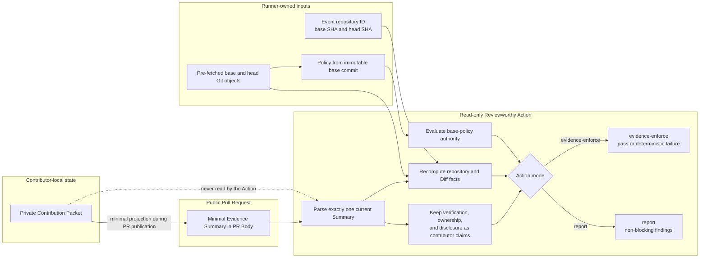

# Action, eval, and Schema CI

The composite Action is read-only and never reads a private Contribution Packet from the checkout. The pull-request Body contains a human-readable contribution-evidence overview followed by exactly one current machine-readable Evidence Summary. The Action parses only the machine block and recomputes repository- and diff-owned facts from runner event identity plus the checked-out Git objects. The overview is maintainer-friendly output from the contributor workflow, not a separate maintainer product.

The overview's readiness label uses the same complete contributor-side blocker set as remote planning, including the canonical Issue link and exact current Diff binding. Verification, ownership, and disclosure remain explicitly labeled contributor claims. “Ready for maintainer review” is not maintainer approval, endorsement, or a quality score. Duplicate or unmatched overview markers are rejected when the Action extracts the machine summary.

```mermaid
flowchart LR
    subgraph LOCAL["Contributor-local state"]
        PACKET["Private Contribution Packet"]
    end

    subgraph PUBLIC["Public Pull Request"]
        SUMMARY["Minimal Evidence Summary in PR Body"]
    end

    subgraph RUNNER["Runner-owned inputs"]
        EVENT["Event repository ID<br/>base SHA and head SHA"]
        GIT["Pre-fetched base and head Git objects"]
        BASEPOLICY["Policy from immutable base commit"]
    end

    subgraph ACTION["Read-only Reviewworthy Action"]
        PARSE["Parse exactly one current Summary"]
        CLAIMS["Keep verification, ownership,<br/>and disclosure as contributor claims"]
        RECOMPUTE["Recompute repository and Diff facts"]
        POLICY["Evaluate base-policy authority"]
        CONCLUSION{"Action mode"}
        REPORT["report<br/>non-blocking findings"]
        ENFORCE["evidence-enforce<br/>pass or deterministic failure"]
    end

    PACKET -->|"minimal projection during PR publication"| SUMMARY
    PACKET -. "never read by the Action" .-> PARSE
    SUMMARY --> PARSE
    PARSE --> CLAIMS
    PARSE --> RECOMPUTE
    EVENT --> RECOMPUTE
    GIT --> RECOMPUTE
    GIT --> BASEPOLICY
    BASEPOLICY --> POLICY
    RECOMPUTE --> CONCLUSION
    CLAIMS --> CONCLUSION
    POLICY --> CONCLUSION
    CONCLUSION -->|report| REPORT
    CONCLUSION -->|evidence-enforce| ENFORCE
```

Default `report` mode keeps missing or uncertain evidence non-blocking. `evidence-enforce` requires:

- one valid current Evidence Summary;
- a real `pull_request` event with exact repository slug, numeric repository ID, base SHA, and head SHA;
- complete merge-base Diff agreement across base tip, merge base, head, canonical subject digest, fingerprint algorithm, changed files, additions, and deletions;
- policy evaluation from the immutable runner-owned base commit.

Before importing the package, the composite wrapper requires a runnable `python`
on PATH with Python >=3.11 and a runnable `git`. Missing or unusable prerequisites
exit with code 2 and an explicit prerequisite error in either mode. Non-blocking
`report` findings assume a usable runtime; they do not suppress environment failures.
Configure Python before invoking the Action. The wrapper adds no third-party
Action steps or runtime dependencies; this repository's CI validates Python
3.11, 3.12, and 3.13.

CI dependency pins were resolved on 2026-09-30 with `git ls-remote` against the
official upstream repositories and cross-checked against their release/commit pages:

- `actions/checkout` `v7` / `v7.0.1` → [`3d3c42e5aac5ba805825da76410c181273ba90b1`](https://github.com/actions/checkout/commit/3d3c42e5aac5ba805825da76410c181273ba90b1).
- `actions/setup-python` `v7` / `v7.0.0` → [`5fda3b95a4ea91299a34e894583c3862153e4b97`](https://github.com/actions/setup-python/commit/5fda3b95a4ea91299a34e894583c3862153e4b97).

The workflow uses these full commits and `persist-credentials: false`; the matrix
and composite wrapper remain unchanged in scope.

Contributor-local verification, Ownership Check, and AI disclosure remain labeled contributor claims. The Action does not reinterpret them as runner-verified facts.

For policy, the Action reads base-tree repository documents and `.reviewworthy/policy.toml`; a Pull Request cannot grant itself authority by changing policy on its head. Positive natural-language claims are advisory. Only structured base-tree TOML supplies positive machine authority. Explicit document prohibitions, cross-source conflicts, single-document ambiguities, invalid structured policy, and applicable structured requirements can block `evidence-enforce`.

Base-tree input diagnostics also block enforcement: missing explicitly selected
documents, unsupported source modes (including symlinks), unreadable sources,
invalid UTF-8/NUL content, unsupported paths, and count/byte limits. `report`
records these as unknowns without turning the head's policy into fallback authority.

The Action does not fetch missing objects, invoke `gh`, create or edit remote records, infer maintainer approval, or judge the substantive quality of a human explanation. Consumers should use `actions/checkout` with `fetch-depth: 0` so the base and head objects exist locally.

For consumption, set workflow `permissions: { contents: read }` for checkout;
Reviewworthy itself uses the event file and local Git objects and needs no
`pull-requests: write`, `issues: write`, `gh` authentication, or secrets. Check out
with `fetch-depth: 0` and `persist-credentials: false`, and ensure the exact event
base/head and their merge base are present. Incomplete history or missing objects
can fail `evidence-enforce`; the Action will not repair history over the network.

Pin checkout, Python setup, and Reviewworthy itself to audited full commit SHAs.
For Reviewworthy, resolve a published ref from its official repository, verify the
commit implements the required current contracts, and inspect it before recording
the full SHA in the consuming workflow. This document supplies no published
Reviewworthy release pin: local implementation commits are not usable external
pins until published. A version tag or branch can move. See GitHub's
[secure use guidance](https://docs.github.com/en/actions/reference/security/secure-use).

Use `pull_request` for this event-based check with read-only permissions and no
secrets on an isolated runner. `pull_request_target` and `workflow_run` can carry
privileged tokens, secrets, and trusted cache access: never execute untrusted head
code, tests, install/build hooks, or a checkout's local `uses: ./` Action in that
context. Load the Action from a trusted immutable pin; treat the PR's Body and Git
objects as data. Base-tree policy authority protects policy evaluation only when
the code performing the evaluation is trusted. The current checker requires a
`pull_request` event; privileged event names do not satisfy enforcement and are
not a supported shortcut. Disabling persisted credentials does not make arbitrary
head code safe in a privileged job. This repository's local `uses: ./` smoke test
runs under its read-only regression workflow to test the wrapper under development.

External-contribution routing remains the consuming repository's responsibility. A Maintainer Change may follow repository-owned direct-push rules while ordinary CI continues to run; the portable Action does not query provider roles.

Fixture evals are provider-free and narrow. Packet cases assert exact blocker sets plus readiness. Action cases assert exact violation sets and conclusion. JSON Schema validation is test/CI-only through `requirements-dev.txt`; Python validators own stateful semantics such as Git identity, semantic freshness, policy provenance, and remote-write readiness.

The local `action check --mode report` smoke test without a PR event demonstrates
the runtime path only. Enforcement evidence comes from fixture-owned events and
Git objects, including malformed events, unavailable base objects and policy
input failures; it is not a live GitHub runner or provider check. Remote creation
recovery, including the manual-inspection and explicitly confirmed
`--retry-uncertain` exception with residual duplicate risk, belongs to the
[contributor CLI](./remote-writes.md), not the Action. Bounded marker inspection
does not promise globally exactly-once writes.
