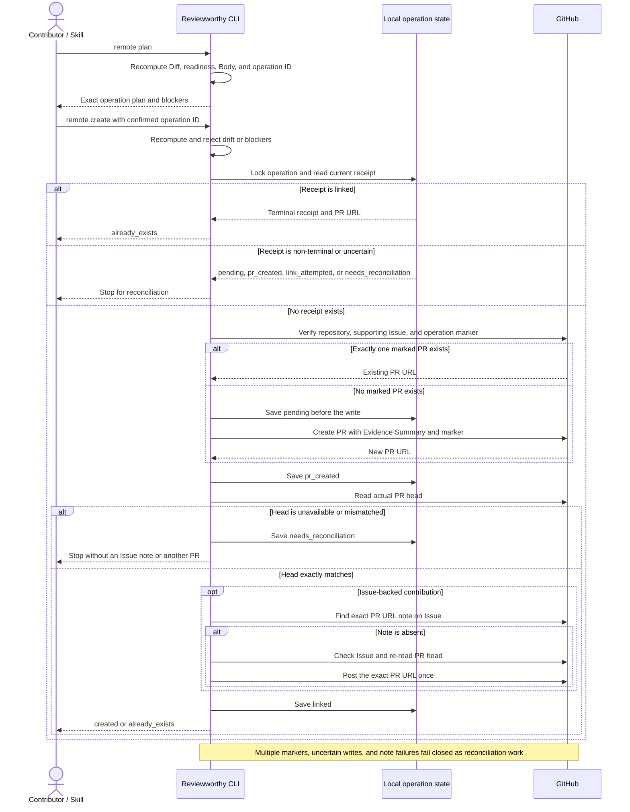

# Remote writes

Remote writes are explicit operations, not incidental side effects.

The CLI first renders the exact target, title, Body, base/head, permissions, and stable operation ID. The user confirms that operation ID. If any rendered field changes, the old confirmation is invalid.

The operation ID is embedded in the Body as:

```text
<!-- reviewworthy:v0.3:operation-id=rw-... -->
```

Every Packet and operation is bound to a GitHub repository identity (`provider`, `host`, `owner`, `name`, and, when known, `repository_id`). The `--repo` target must match that identity. Pull-request plans resolve the requested base and head refs to SHAs; moving a branch changes the operation identity and invalidates the previous confirmation.

Before creating an Issue or Pull Request, the `gh` adapter searches existing objects for the marker. If the previous result is uncertain, it stops for reconciliation rather than retrying blindly.

Remote readiness also requires an approved Contribution Contract whose approval snapshot still matches the Contract, a Packet `0.3` merge-base Diff identity (`base_tip_sha`, `merge_base_sha`, `head_sha`, canonical `subject_digest`, fingerprint algorithm, changed files, and counts), and contributor-local receipt `0.3` evidence bound to the Packet plan digest and subject. Discovery or signal-backed work needs a valid non-rejected Signal `0.3`; external records need current provider verification, while local reproducible evidence needs explicit policy allowance. Standard requires Ownership Check; Heightened and Learning also require current Orientation and Assessment. If policy requires a Draft PR, the operation includes that state and invokes `gh pr create --draft`. Timestamps and output hashes are audit-only.

For a Pull Request backed by an Issue, the final Body must contain the canonical Issue URL. After the PR exists, Reviewworthy uses one receipt with the lifecycle `pending → pr_created → link_attempted → linked` or `needs_reconciliation`. It reads the actual PR head after create or remote reconciliation and requires an exact match with the operation head. It then searches the Issue comments for an exact one-line PR URL. Only when that note is absent does it check that the Issue is present, unlocked, and commentable, recheck the PR head immediately before the write, then write that one note. An unavailable or mismatched head and a failed note write record `needs_reconciliation`; they never create another PR and the CLI does not retry the note automatically. GitHub exposes head reads and Issue comments as separate APIs, so a concurrent update during the comment POST remains a narrow non-atomic provider race.



Immediately before a create, the CLI persists a pending operation record. After a successful create it replaces that record with ignored `local/v0.3/operations/` state. Every record carries `state_version=0.3`; older paths and unversioned states are not read or reconciled. The receipt bridges GitHub's short read-after-write delay: an immediate retry returns `already_exists` without issuing a second create request. A pending, malformed, incomplete, mismatched, or multiply matched marker is a reconciliation error, not permission to retry.

`signal publish` is an Issue-only remote operation for turning a local Discovery draft into a public Signal. Its plan requires `--repository-id`, binds that immutable GitHub identity into the operation, and rechecks the live numeric ID immediately before reconciliation or creation. It has its own stable operation subject and updates the Signal artifact only after the same receipt protocol succeeds. Discussion publication is intentionally not inferred from or silently substituted for an Issue publication.
