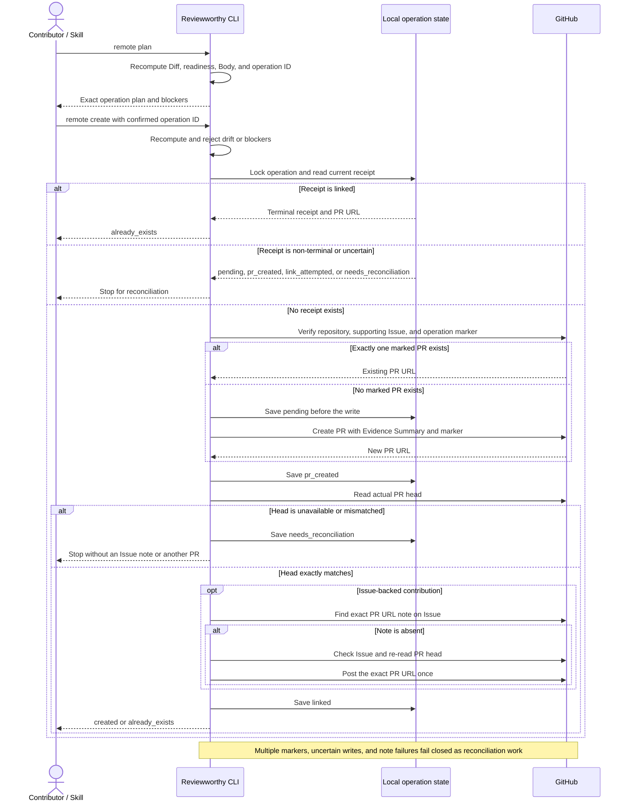

# Remote writes

Remote writes are explicit operations, not incidental side effects.

The CLI first renders the exact target, title, Body, base/head, permissions, and stable operation ID. The user confirms that operation ID. If any rendered field changes, the old confirmation is invalid.

Before planning, record and approve the current public narrative:

```bash
reviewworthy packet narrative record --packet "$PACKET" --title "Fix the bounded failure" --body-file body.md --json
reviewworthy packet narrative preview --packet "$PACKET" --output .git/reviewworthy/body.md --json
reviewworthy packet narrative confirm --packet "$PACKET" --human-confirmed --json
```

`record` preserves the exact title/Body and accepts optional `--human-expression-file`
for contributor-authored motivation, trade-offs and risks. Changed prose or human
expression clears final approval; identical recording preserves it. `preview` is
read-only for the Packet and displays current prose plus the public evidence
projection with blockers for proposed confirmation. Its optional output saves the
raw Body for `remote plan/create`; that file is a convenience and carries no authority.
`confirm` asserts explicit human approval after viewing the preview, confirms the
current disclosure, and requires complete current evidence, exact Issue linkage,
policy disclosure and human-expression gates. It does not infer stage verification.
There is no additional confirmation artifact or challenge. `remote plan` recomputes
Git identity and adds the operation marker; its title/Body inputs must equal the
Packet text exactly, including whitespace. Review that final plan before confirming
its operation ID. Changes to implementation, required verification, Ownership,
understanding, AI claims or prose require the appropriate human reapproval.

The operation ID is embedded in the Body as:

```text
<!-- reviewworthy:v0.3:operation-id=rw-... -->
```

Every Packet and operation is bound to a GitHub repository identity (`provider`, `host`, `owner`, `name`, and, when known, `repository_id`). The `--repo` target must match that identity. Pull-request plans resolve the requested base and head refs to SHAs; moving a branch changes the operation identity and invalidates the previous confirmation.

Before creating an Issue or Pull Request, the `gh` adapter searches existing objects for the marker. If the previous result is uncertain, it stops for reconciliation rather than retrying blindly.

Remote readiness also requires an approved Contribution Contract whose approval snapshot still matches the Contract, a Packet `0.3` merge-base Diff identity (`base_tip_sha`, `merge_base_sha`, `head_sha`, canonical `subject_digest`, fingerprint algorithm, changed files, and counts), and contributor-local receipt `0.3` evidence bound to the Packet plan digest and subject. Discovery or signal-backed work needs a valid non-rejected Signal `0.3`; external records need current provider verification, while local reproducible evidence needs explicit policy allowance. Standard requires Ownership Check; Heightened and Learning also require current Orientation and Assessment. If policy requires a Draft PR, the operation includes that state and invokes `gh pr create --draft`. Timestamps and output hashes are audit-only.

For a Pull Request backed by an Issue, the final Body must contain the canonical Issue URL. After the PR exists, Reviewworthy uses one receipt with the lifecycle `pending → pr_created → link_attempted → linked` or `needs_reconciliation`. It reads the actual PR head after create or remote reconciliation and requires an exact match with the operation head. It then searches the Issue comments for an exact one-line PR URL. Only when that note is absent does it check that the Issue is present, unlocked, and commentable, recheck the PR head immediately before the write, then write that one note. An unavailable or mismatched head and a failed note write record `needs_reconciliation`; they never create another PR and the CLI does not retry the note automatically. GitHub exposes head reads and Issue comments as separate APIs, so a concurrent update during the comment POST remains a narrow non-atomic provider race.


```mermaid
sequenceDiagram
    actor User as Contributor / Skill
    participant CLI as Reviewworthy CLI
    participant Local as Local operation state
    participant GitHub

    User->>CLI: remote plan
    CLI->>CLI: Recompute Diff, readiness, Body, and operation ID
    CLI-->>User: Exact operation plan and blockers
    User->>CLI: remote create with confirmed operation ID
    CLI->>CLI: Recompute and reject drift or blockers
    CLI->>Local: Lock operation and read current receipt

    alt Receipt is linked
        Local-->>CLI: Terminal receipt and PR URL
        CLI-->>User: already_exists
    else Receipt is non-terminal or uncertain
        Local-->>CLI: pending, pr_created, link_attempted, or needs_reconciliation
        CLI-->>User: Stop for reconciliation
    else No receipt exists
        CLI->>GitHub: Verify repository, supporting Issue, and operation marker
        alt Exactly one marked PR exists
            GitHub-->>CLI: Existing PR URL
        else No marked PR exists
            CLI->>Local: Save pending before the write
            CLI->>GitHub: Create PR with Evidence Summary and marker
            GitHub-->>CLI: New PR URL
        end
        CLI->>Local: Save pr_created
        CLI->>GitHub: Read actual PR head
        alt Head is unavailable or mismatched
            CLI->>Local: Save needs_reconciliation
            CLI-->>User: Stop without an Issue note or another PR
        else Head exactly matches
            opt Issue-backed contribution
                CLI->>GitHub: Find exact PR URL note on Issue
                alt Note is absent
                    CLI->>GitHub: Check Issue and re-read PR head
                    CLI->>GitHub: Post the exact PR URL once
                end
            end
            CLI->>Local: Save linked
            CLI-->>User: created or already_exists
        end
    end

    Note over CLI,GitHub: Multiple markers, uncertain writes, and note failures fail closed as reconciliation work
```

Immediately before a create, the CLI persists a pending operation record. After a successful create it replaces that record with ignored `local/v0.3/operations/` state. Every record carries `state_version=0.3`; older paths and unversioned states are not read or reconciled. The receipt bridges GitHub's short read-after-write delay: an immediate retry returns `already_exists` without issuing a second create request. A pending, malformed, incomplete, mismatched, or multiply matched marker is a reconciliation error, not permission to retry.

`signal publish` is an Issue-only remote operation for turning a local Discovery draft into a public Signal. Its plan requires `--repository-id`, binds that immutable GitHub identity into the operation, and rechecks the live numeric ID immediately before reconciliation or creation. It has its own stable operation subject and updates the Signal artifact only after the same receipt protocol succeeds. Discussion publication is intentionally not inferred from or silently substituted for an Issue publication.

Current state is validated independently of the create retry rule. A pending record
still stops ordinary create. The stored marked Body cannot reproduce every
original hash input because creation stripped trailing whitespace; state validation
checks its shape and ID/marker consistency, and does not authenticate local state.
A lock left by a killed process is never deleted automatically: verify that no
process owns it, inspect the remote operation manually, remove only that operation's
`.json.lock`, then reconcile the preserved `.json` record.

To recover an existing current operation independently of today's Packet, files or
Git refs, preserve its state file and run:

```bash
reviewworthy remote reconcile --state /path/to/local/v0.3/operations/rw-ID.json --json
```

Reconcile verifies the immutable live repository ID, reads a known URL directly,
and searches the marker with bounded transport reads. Zero matches without a known
URL preserves pending state. Multiple matches report their canonical URLs and block.
A removed marker, changed title/Body, PR base/draft drift or changed original head
requires manual inspection; the command never creates an object or rewrites its Body.
Without confirmation it may repair local receipts and record an existing Issue note.
For an absent note only, use the saved operation ID:

```bash
reviewworthy remote reconcile --state STATE --confirm-operation-id rw-ID --json
```

That permits at most one exact one-line Issue note after commentability and original
PR head rechecks. An existing note is not posted again. Incomplete live inspection
or a wrong confirmation cannot authorize this write. A cached create response with
`source=local_receipt` is historical evidence; reconcile performs the current check.

Recover Signal publication (including a later artifact-write interruption) with:

```bash
reviewworthy signal publish reconcile SIGNAL_PATH --state STATE --json
```

The command uses the same read-only remote inspection and repairs only the matching
Signal target's reference, stable publication subject and publication fields. It
preserves pending lifecycle and human authority. New publication records retain the
original Signal input, exact original Body and target path; materially edited or
unrelated targets are refused, and a missing original output can be restored.
Reconcile rechecks target existence and content immediately before replacement;
a target edited, deleted or newly created during remote inspection is preserved
for manual recovery rather than overwritten.
Pre-existing current `0.3` records lack that snapshot: recovery can compare their
stable subject, claim, pending lifecycle and recorded publication inputs, but cannot
prove that unrecorded original evidence/authority fields were unchanged or recover
original trailing Body whitespace when no artifact retains it. When a matching
publication already retains the exact original Body, reconcile validates and
preserves it. These local records are unsigned implementation state, so preserve
and inspect the original artifact during recovery.

An uncertain object creation may be retried only after manual remote inspection,
with the original create inputs, original operation-ID confirmation and explicit
`--retry-uncertain` on `remote create` or `signal publish create`. This opts into
residual duplicate risk if a prior write is still invisible. It requires an existing
valid pending record with no known object, normal current readiness/input checks,
live immutable repository identity and a fresh complete zero-match search. One
appearing match is reconciled; multiple or incomplete matches stop. Write-ahead
state precedes exactly one create attempt. A created/linked PR or uncertain Issue
note must use reconcile instead. Another failure preserves recoverable state.

After a canonical create response, Reviewworthy saves the known URL, reads that
object directly, and performs one bounded marker search. Visible duplicates include
all canonical URLs in diagnostics. A delayed zero-match list, unavailable list, or
unreadable/changed object retains the known result and reports `needs_reconciliation`;
it never authorizes another create. A PR waits for complete inspection before its
Issue note. Issue and Signal receipts retain the successful canonical create and
its inspection evidence; immediate ordinary create retry can still return the
historical `already_exists` result. Run reconcile for a current remote check.
Detection covers visible provider records and is not globally exactly-once or an
assurance that every concurrent write is instantly visible. There is no polling.
